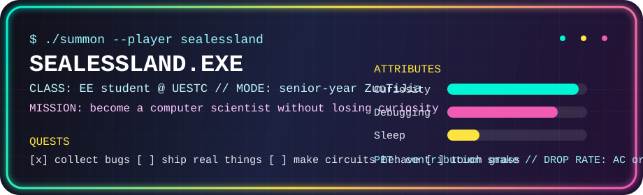

<div align="center">


<a href="https://git.io/typing-svg">
  
</a>

<p>
  
  
  
</p>

<p>
  
  
  
</p>



</div>

---

## 🧭 Tiny Map

<table>
<tr>
<td width="50%">

### 🎮 Player Card

```txt
Name      : Sealessland / RAY
Class     : EE student @ UESTC
Main Quest: become a computer scientist
Build     : curiosity++ / commitment pending
Status    : senior-year ZuoTiJia mode
```

</td>
<td width="50%">

### 🧪 Current Loadout

```txt
Weapon    : algorithms, circuits, terminals
Pet       : a snake eating my contribution graph
Buff      : caffeine + late-night debugging
Debuff    : interested in everything
```

</td>
</tr>
</table>

## 🕹️ Quest Log

- 🧠 **Main quest:** survive senior year, keep learning, ship more real things.
- ⚡ **Side quests:** algorithms, systems, EE stuff, and whatever new rabbit hole appears at 2 AM.
- 🤝 **Co-op mode:** collaborations welcome — QQ `2692231726`.
- 🧩 **Daily puzzle:** turn one more bug into an accepted solution.

## 🐍 Contribution Snake

<div align="center">
  <picture>
    <source media="(prefers-color-scheme: dark)" srcset="https://raw.githubusercontent.com/Sealessland/Sealessland/output/github-contribution-grid-snake-dark.svg">
    <source media="(prefers-color-scheme: light)" srcset="https://raw.githubusercontent.com/Sealessland/Sealessland/output/github-contribution-grid-snake.svg">
    
  </picture>
</div>

## 🔥 Boss Room

<div align="center">
  
  <br />
  
</div>

<details>
<summary>🎁 Open loot box</summary>

```txt
You found:
  +1 bug report
  +3 mysterious TODOs
  +5 minutes of confidence before the next compile error
  +∞ reasons to keep building
```

</details>

---

<div align="center">
  <b>Thanks for visiting. If the snake is moving, I'm probably debugging.</b>
  <br />
  
</div>
