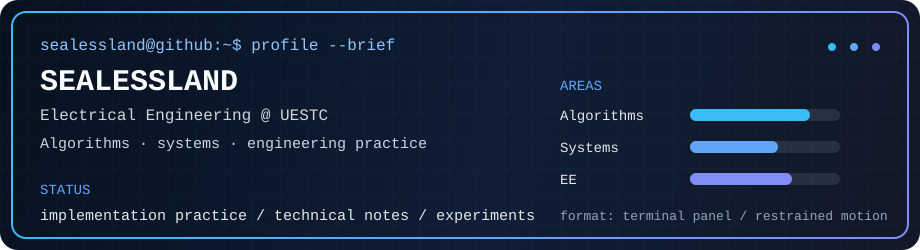

  
  
  

  
  
  

---

## About

Electrical Engineering student at UESTC. This profile collects code, notes, and experiments around systems, tooling, and engineering practice.

- Undergraduate student in Electrical Engineering.
- Main interests: systems, tooling, EE-related technical work, and reproducible notes.
- Working on implementation practice and technical documentation.
- Contact: QQ `2692231726`.

## Focus

- **Systems:** operating systems, low-level tooling, and terminal workflows.
- **Engineering:** circuits, signals, experiments, and technical documentation.
- **Tools:** scripts, notes, and small utilities for study and workflow.

## Activity

  <picture>
    <source media="(prefers-color-scheme: dark)" srcset="https://raw.githubusercontent.com/Sealessland/Sealessland/output/github-contribution-grid-snake-dark.svg">
    <source media="(prefers-color-scheme: light)" srcset="https://raw.githubusercontent.com/Sealessland/Sealessland/output/github-contribution-grid-snake.svg">
    
  </picture>

---

  Profile README. External cards are kept only when they render reliably.
   
  

